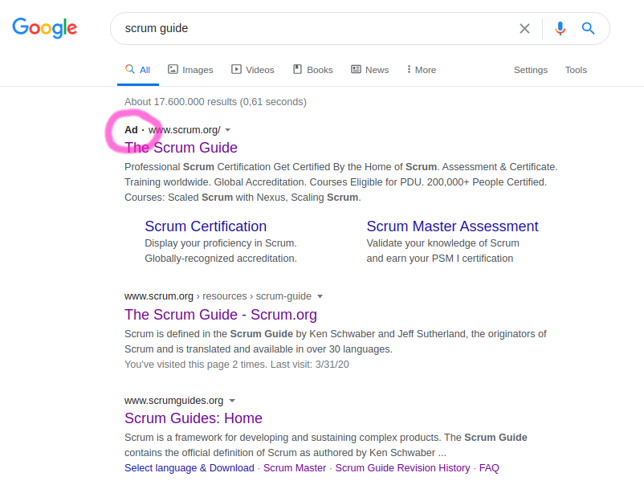

# Scrum: My point of view

My personal opinionated point of view about [Scrum](https://en.wikipedia.org/wiki/Scrum).

# Story points

> A: Will the old bridge hold us when we go over it?
>
> B: I am unsure. The bridge looks very old.
>
> A (fells fear): If we go over it and it ... collapses?
>
> B: Then it might be wise to not go over it, and instead we dance over it.
>
> A (relieved, happy): Great idea! If our heart is filled with joy we feel much lighter and then the bridge holds us. Good idea!
>
> B: ???

Most developers work 8 hours per day. But since some Scrum Gurus said you should use Story Points, most teams do it.

Yes, I have read this [Jeff Sutherland "Story Points: Why are they better than hours?"](https://www.scruminc.com/story-points-why-are-they-better-than/).

I like challenges: As a developer, if I have a task which is estimated at 4 hours, this gives me a challenge: Solve it in three hours!

If I have a task that is measured in story points, then I don't have this personal challenge.

Now you could argue, I should find a magic function which maps from Story Points to hours. Then I have the same challenge. But wait: Why should I do this dancing forward and dancing backward again? 

But maybe these fancy units have benefits. For examplel the "Jeff Bezos' 2 Pizza Rule". Why no use a boring range like "5 to 7 people"? Don't ask me. Somehow "2 Pizza Rule" is way better than a boring numbers. Maybe it is the same for "story points vs hours". Maybe selling ideas more important than having great ideas.

# Scrum is free - no money involved?

Scrum is free. We all love each other. No money is involved?

If I search for "scrum guide" I get this result:

There is an advertisment.

This means scrum.org is paying google money to get to the top of this page.

So you should be aware of the fact that there is some marketing campaign behind scrum.

There are people who earn more money if more people use scrum.

