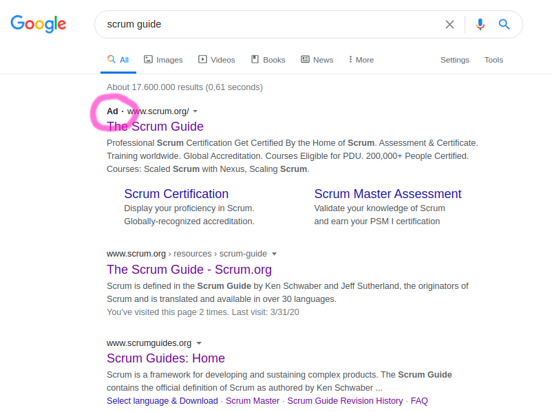
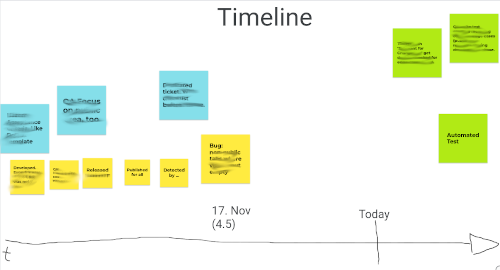

# Scrum: My point of view

I was a Scrum Master for one year (2020). It was fun and I want to share some of my findings.

My personal opinionated point of view about [Scrum](https://en.wikipedia.org/wiki/Scrum).

Don't get me wrong: I like Scrum. Here are some things where I think different.

# Story points

> A: Will the old bridge hold us when we go over it?
>
> B: I am unsure. The bridge looks very old.
>
> A (fells fear): If we go over it and it ... collapses?
>
> B: Then it might be wise to not go over it, and instead we dance over it.
>
> A (relieved, happy): Great idea! If our heart is filled with joy we feel much lighter and then the bridge holds us. Good idea!
>
> B: ???

Most developers work 8 hours per day. But since some Scrum Gurus said you should use Story Points, most teams do it.

Please pay attention to the previous sentence. I wrote "Scrum Gurus", not "Scrum Guide". The official Scrum Guide only talks about "estimates".

Yes, I have read this [Jeff Sutherland "Story Points: Why are they better than hours?"](https://www.scruminc.com/story-points-why-are-they-better-than/).

I like challenges: As a developer, if I have a task which is estimated at 4 hours, this gives me a challenge: Solve it in three hours!

If I have a task that is measured in story points, then I don't have this personal challenge.

Now you could argue, I should find a magic function which maps from Story Points to hours. Then I have the same challenge. But wait: Why should I do this dancing forward and dancing backward? With "dancing" I mean converting between the unit "Story Points" and "Hours".

But maybe these fancy units have benefits. For examplel the "Jeff Bezos' 2 Pizza Rule". Why no use a boring range like "5 to 7 people"? Don't ask me. Somehow "2 Pizza Rule" is way better than a boring numbers. Maybe it is the same for "story points vs hours". 
Maybe selling colorful stories is more important than boring math.

I think estimating in hours would make more sense.

This would sharpen your awareness concerning interruptions. You could ask yourself: Why did it took longer than estimated?
Where there interrupts? What kind of interrupts?

You could argue that a juniour developer needs longer than a senior developer. Nevertheless I prefer hours. 

# Team size

Most Agile and Scrum training courses refer to a 7 +/- 2 rule.

My personal opinion: The team should not have more than 6 members.

# Team lifetime

Every 12 to 18 month the scrum team should get dissolved and new teams should get born. 

This reorganization forces every team member to leave the autopilot. This is an interesting
adventure (although many people don't like changes). It helps knowledge-sharing and avoids the bore-out syndrome.

# Sprints vs Kanban

In my experience only 5% of Sprints have **one** well defined goal. Most Sprints have 3 to 5 goals.

This raises the question: "Is a sprint goal needed?". I can happily live without it. It is like a constant flow of issues: New features, old bugs, refactoring and fire-fighting.

Example: We start a new sprint and have capacity for 40 Story Points. We fill the sprint backlog with 15 issues. Now have a look at these 15 issues. Many of them are not related to another. They are issues. Some small, some big. 

It would be nice to have one common sprint goal. Since we are all social beings, it gives us
a warm feeling inside. I think that is one major feature why a lot of people want to do scrum. Although I have never
seen a sprint with **one** sprint goal. 

If there is no useful common denominator, why create a Sprint Goal?

I think this kind of thinking is 100% fine. Maybe Kanban makes more sense?

I think it makes sense to have 2 week sprints. Because the highlight after work is the [Sprint-Review](https://www.scrumguides.org/scrum-guide.html#sprint-review) where the Scrum Team presents the results of their work to key stakeholders. 

# A sprint is a less than short-term

Maybe I am blind, but up to now I could not find information in the scrum guide about the long term planning.

Working in two week sprints is fine.

Nevertheless you need a bit more.

You should be aware of this.

For me, short-term means 3..6 months, mid-term means 6..12 months, long-term means 12.. months.

If you look at Scrum this way, a Sprint is less than "short-term".

# Velocity

The Scrum Guide does not use the term "Velocity". But this glossary does contain it: [Glossary of scrum.org](https://www.scrum.org/Resources/Scrum-Glossary)

There are rumours that the velocity should get better and better and better until the scrum team flies with the speed of light (joking)

If the leaders want the velocity to increase, they will get what they want. The puzzle is easy to solve. Developers will just need to use higher estimates. Higher estimates, higher velocity.

I don't think that you can measure velocity. Every development task is different. 

If leaders want high and increasing velocity, then developers won't do very important tasks like cleaning up code, writing tests, trying new tools, etc. If leaders want it like this, they will get it. Finally some developers will get borded and look for a different company to work for.

# Review/Demo

I prefer the term "Demo", since "Review" could mean "Pull-Request Review", too.

Here are three ways how to present the increment to the stakeholders.

* Best: A fluent live demo. The new features get presented in a testing system and there are not hiccups.
* Good: A fluent presentation of screenshots. The screenshots show the state before the change and after the change.
* Bad: A live demo with a lot of hiccups

Since it is waste of time to make things perfect ([Pareto Principle](https://en.wikipedia.org/wiki/Pareto_principle)) I prefer the second solution: A fluent presentation of before/after screenshots.

The people who did the changes should present their work. Not the scrum master or product owner.

# Scrum is free - no money involved?

Scrum is free. We all love each other. No money is involved?

If I search for "scrum guide" I get this result:

There is an advertisment.

This means scrum.org is paying google money to get to the top of this page.

So you should be aware of the fact that there is some marketing campaign behind scrum.

There are people who earn more money if more people use scrum.

Maybe Scrum is more successful than Kanban in the last years (see [Google Trend "Scrum Kanban"](https://trends.google.com/trends/explore?date=today%205-y&q=%2Fm%2F01mwhw,%2Fm%2F0ck_p8)) because Scrum has a better marketing campaign?

This gets apparent if you read about the [SEU (Scrum Education Units)](https://www.scrumalliance.org/get-certified/scrum-education-units).

Why are so many people attending the scrum conferences? Because the people want to get Scrum Education Units. Why are there many Scrum Meetups? Because people want to get Scrum Education Units.... 

It is like a [pyramid scheme](https://en.wikipedia.org/wiki/Pyramid_scheme). At the top is the Scrum Alliance which gets money from the [Registered Education Providers](https://www.scrumalliance.org/get-certified/trainers/become-a-rep). The Registered Education Providers get money by people like you and me.

There are a lot of certications in the scrum/agile context. Like in every pyramid scheme, you can climb the ladder step by step by attending courses.

See: [Scrum Alliance Certs](https://www.scrumalliance.org/get-certified)

Maybe it is better to invest money in certification than to spend money on beer, but I am sceptical. 

But a lot of other institutions do it the same way. See [Professional Development Units (PDU)](https://www.pmi.org/certifications/maintain/pdu)

# The term "Sprint".

I like long-distance running. A half marathon (21km) are a great distance. Depending on the mood and entuisiasm this means one and a half or two hours of constant workout. I like it.

I am not a sprinter. I am too slow on short distances.

And now back to software development with Scrum: The interesting things won't get solved in one sprint.

I am not happy with the term "Sprint", but up to now I found no better alternative. Do you have one?

# Beyond Sprint

I guess the C-level wants more than two week planing. They think in quarters and years.

Scrum only defines the sprint, but no higher level or long term planing.

[Quarterly OKRs](https://en.wikipedia.org/wiki/OKR) can be used for planing beyond two/three week sprints.

That's great. Now you have both: Waterfall/Gantt and Scrum ... oh what fun.

# Retro Topics

* How can we in our team achieve [collective intelligence](https://en.wikipedia.org/wiki/Collective_intelligence) and avoid [groupthink](https://en.wikipedia.org/wiki/Groupthink)?

# Retro Tools

* Google Forms. This way the participants don't see what the other participants write. They need to think on their own first. Later you can share your screen and everybody can see the answers of all participants.

# Personal Feedback Retro

After a scrum team worked for several sprints, it is time for a personal feedback retro. I did it like this: I created a empty for every team member. Each board had a heading (the name of the team member) and three columns (keep on doing, stop doing, start doing).

In 15 minutes everybody could add sticky notes to the board of other team members. Before that the moderator (Scrum Master) should remind the people to use a kind and future-focused perspective. The focus should be on "What could be improved?", not "What was done wrong in the past".

After that every team member had time to read the note he received.

One day later we go through the board and everybody has the possiblity to speak about the feedback he received and to ask questions.

This was very fruitfull.

# Pragmatic Post-Mortem

If there was a bug which caused trouble to users, then it is wise to schedule a post-mortem. This helps to find the root-cause, get a common perspective and it should result in some action points to ensure the same bug does appear again.

One of several ways to run such a meeting is to use a timeline three levels:

* First level, yellow: The facts. All participants should agree here
* Second level, blue: Should: What should have been done
* Third level: green: Action-items. Who does what during the next days.

It is important that this is not about plaming people. It is about finding ways to improve the processes. The moderator (Scrum Master) should remind the participants if the mood gets non-professional.

# "Scrum Master"

I worked as Scrum Master for one year. I learned a lot. Nevertheless if I could give the role a name, I would call it "Team Coach". This would underline the actual role: Be a servant leader for the team. And be a coach, not the one who is actually doing things.

# First "Agile", then "Blabla".

I like the [Agile Manifesto](https://agilemanifesto.org/). If you don't know it yet, then please follow the last hyperlink and read the short text.

Let's have some fun. Look at these terms:

* Agile Transformation
* Agile Management
* Agile Journey
* Agile Champions
* Agile Principles
* Agile Process
* Agile Mindset
* Agile World
* Agile Terminology
* Agile Teams
* Agile Organization
* Agile Framework
* Agile Thinking

You do prefer it strategic? OK, here you go:

* Strategic Transformation
* Strategic Management
* Strategic Journey
* Strategic Champions
* Strategic Principles
* Strategic Process
* Strategic Mindset
* Strategic World
* Strategic Terminology
* Strategic Teams
* Strategic Organization
* Strategic Framework
* Strategic Thinking

Does this sound even more serious?

Managers and Leaders tend use these terms because .... I don't know why.

But what does the average non-manager, non-leader hear if the upper levels talk like this? I hope you are able to laugh about yourself,
if you like to play the buzzword bingo game:

* Childish Transformation
* Childish Management
* Childish Journey
* Childish Champions
* Childish Principles
* Childish Process
* Childish Mindset
* Childish World
* Childish Terminology
* Childish Teams
* Childish Organization
* Childish Framework
* Childish Thinking

Finally it is about one thing: Can we deliver a something which customers will like? How much does it cost us, how much will we receive?

My guideline: Avoid the meta-level, otherwise communicating will likey get childish blublu-blabla. Be precise, implement small solutions today instead of talking about big solutions which are likely to fail.

BTW, I like the [Getting Things Done Method](https://en.wikipedia.org/wiki/Getting_Things_Done) of David Allen, [WOOP](https://woopmylife.org/en/home) of Prof. Dr. Gabriele Oettingen and [Nonviolent Communication](https://en.wikipedia.org/wiki/Nonviolent_Communication) of  Marshall Rosenberg. These methods help me more than the Agile Stuff.

Some years ago "strategic" was the buzzword. Today "agile" is the buzzword. Let's see what will come next. Maybe "sustainable", "resilient" or "cloud native".

# "Agile" and "Scrum" don't get mentioned

There is a 500 pages book about [Software Engineering at Google](https://www.oreilly.com/library/view/software-engineering-at/9781492082781/). It contains condensed wisdom by great experts. The index of the book does not contain the words "Agile" or "Scrum". If you use the full-text search, you find both terms, but only only in non-relevant side-notes.

# Sprint Retrospective
 
[Scrum Guide: Sprint Retrospective](https://www.scrumguides.org/scrum-guide.html#sprint-retrospective)
 
> The Scrum Team inspects how the last Sprint went with regards to individuals, interactions, processes, tools, and their Definition of Done.
 
A common question: Should PO to participate the retrospective?
 
The "Scrum Team" means: Dev, Product-Owner and Scrum-Master. So the answer to this question is "Yes, the PO participates the Retro".
 
The PO is pushing the team. That's his job. He decides what to do by ordering Product Backlog items. 
The developers mostly care about the "how to do it".
 
If there is a good relationship between the PO and the developers, then this is no problem.

Let's celebrate a prejudices: Developers tend to be silent, they prefer to program and avoid detailed discussions.

It is the job of the SM to ensure that during the Retro the PO does not push. The SM needs to encourage silent team members to speak up.

But if the PO is pushing hard, and the developers are too shy, then there is a problem.
Developers might predect upcoming technical issues better
than the PO (since the PO prevers usualy prefers new features to QA). 

If the Scrum-Master has the feeling that there is an [elephant in the room](https://en.wikipedia.org/wiki/Elephant_in_the_room) 
then it is his/her
duty to set up a meeting without the PO.

# More

[Thomas WOL: Working out Loud](https://github.com/guettli/wol)

